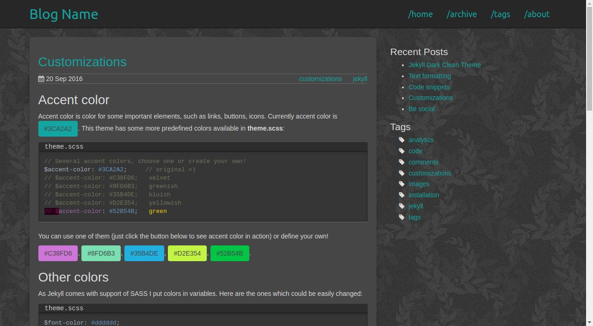

Jekyll Clean Dark
============

This theme was created on top of Jekyll Clean theme by Scotte, you can view the original version in action [on his blog](https://scotte.github.io).

* Get it from [github](https://github.com/streetturtle/jekyll-clean-dark).
* See the [live demo](http://pavelmakhov.com/jekyll-clean-dark).
* See it [in action on my own blog](http://pavelmakhov.com).
* Easily [customizable](http://pavelmakhov.com/jekyll-clean-dark/2016/09/customizations)

This theme uses some parts of Twitter Bootstrap, which allows it to look nice on a mobile devices using a collapsable nav bar and hiding the
sidebar.

Optionally you can use:

 - [Disqus](http://disqus.com) as a comments system;
 - [Google Analytics](http://www.google.com/analytics/);
 - [Yandex Metrica](http://metrica.yandex.com);
 - Blog tags - check the section below;
 - Share buttons.

All these features could be set up in `_config.yml`. Also you can have social icons which could lead to your social profiles. It uses [font-awesome](http://fontawesome.io/), so you can have any icon you want to any social profile. Out-of-the box it has: LinkedIn, GitHub, StackOverflow, LastFm, Instagram. And you can easily add more by adding new style in `theme.css` and setting it in `_config.yml`.

Installation
============

If you dont't have your own blog you can clone this repository and put your articles in a `_posts` folder.
If you already have your own blog then I think you can clone this repository and copy-paste content keeping your `_posts` folder.

After you will have to set up your `_config.yml`

Gem Installation
================

Follow the instructions on the Jekyll [site](https://jekyllrb.com/docs/themes/). Then copy the following files from this repository:

 -_config.yml
 - about.md
 - admin.md
 - archive.html
 - feed.xml 
 
Blog tags
=========

To use this feature you simply will need to create a markdown file for each tag which you are using in you site in **tag** folder. To simplify this procedure there is an [/admin](http://pavelmakhov.com/jekyll-clean-dark/admin.html) page, which outputs the bash command which you just need to run inside **tag** folder of your site. Also don't forget to rerun it when you add a post with new tag.

License
=======

The content of this theme is distributed and licensed under a
[Creative Commons Attribution 4.0 License](https://creativecommons.org/licenses/by/4.0/legalcode)

    This license lets others distribute, remix, tweak, and build upon your work,
    even commercially, as long as they credit you for the original creation. This
    is the most accommodating of licenses offered. Recommended for maximum
    dissemination and use of licensed materials.

In other words: you can do anything you want with this theme on any site, just please
provide a link to the original theme on github.

This theme includes the following files which are the properties of their
respective owners:

* js/bootstrap.min.js - [bootstrap](http://getbootstrap.com)
* css/bootstrap.min.css - [bootstrap](http://getbootstrap.com)
* js/jquery.min.js - [jquery](https://jquery.com)
